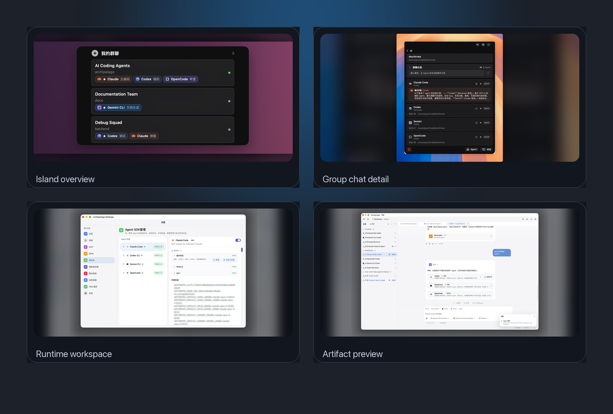
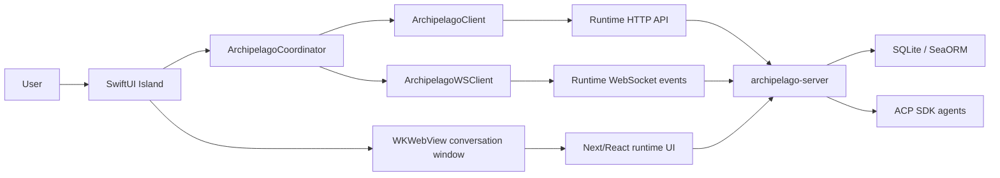

# Archipelago


Archipelago is a macOS agent-collaboration app for creating, operating, and reviewing multi-agent coding group chats from one desktop surface.

It ships as one product, `Archipelago.app`. Internally, it combines a native SwiftUI Island shell with an embedded Archipelago Server runtime that provides the web chat UI, ACP agent sessions, SQLite persistence, artifact preview/editing, settings, and LAN web service access.

Chinese version: [README_zh.md](./README_zh.md)
## Video


https://github.com/user-attachments/assets/89d5c619-5cfc-46a4-ae5e-9dc7cce154d9


## Screenshots



## Table of Contents

- [Screenshots](#screenshots)
- [Highlights](#highlights)
- [Quick Start](#quick-start)
- [Product Surfaces](#product-surfaces)
- [Repository Layout](#repository-layout)
- [Architecture](#architecture)
- [Sync Model](#sync-model)
- [Multi-Agent Collaboration](#multi-agent-collaboration)
- [Artifact Preview And Editing](#artifact-preview-and-editing)
- [Development](#development)
- [Demo Flow](#demo-flow)
- [Packaging](#packaging)
- [GitHub Release](#github-release)
- [Focused Checks](#focused-checks)
- [Documentation](#documentation)
- [Project Status](#project-status)

## Highlights

- Create project group chats from the macOS Island surface.
- Bind a group chat to a workspace folder, a set of agents, roles, and a primary orchestrator agent.
- Open the primary group conversation or a specific group agent conversation in the embedded runtime window.
- Keep group chat and group-agent CRUD synchronized between Island and Archipelago Server.
- Reflect live agent status in Island: busy while an agent is replying or delegated, idle after completion.
- Show recent reply summaries and completion notifications in Island.
- Coordinate multiple agents through `@agent`, `@all`, or Island group-task auto delegation.
- Render inline artifact preview cards for generated or referenced files.
- Preview/edit code, Markdown, images, HTML/iframe output, PPTX slides, diffs, and available history from the conversation.
- Send selected artifact/editor content back into chat as local edit context.
- Configure ACP SDK agents from the embedded runtime settings.
- Expose the embedded web service on the LAN with token-protected APIs.
- Preserve AI collaboration evidence through Trellis specs, skills, workflow rules, PRDs, and journals.

Only group chats created or managed by Archipelago are in scope. Historical standalone runtime conversations are not imported into Island automatically.

## Quick Start

Prerequisites:

- macOS 14+
- Xcode command line tools / Swift Package Manager
- Node.js and pnpm
- Rust and Cargo
- Locally working agent CLI/SDK configuration for the agents you want to use

Build and launch the integrated app:

```bash
cd modules/collaboration-runtime
pnpm install
pnpm build
```

```bash
cd modules/collaboration-runtime/src-tauri
cargo build --release --bin archipelago-server --bin archipelago-mcp --no-default-features
```

```bash
cd apps/archipelago-macos
swift build --product ArchipelagoApp
zsh scripts/launch-packaged-app.sh
```

The launch script packages and opens:

```text
apps/archipelago-macos/output/package/Archipelago.app
```

## Product Surfaces

### Island

The native Island surface is the lightweight control plane:

- Collapsed state shows active group/agent signals and group count.
- Expanded home shows group chat overview, workspace, agent badges, and status.
- Group detail shows members, primary agent, latest response summaries, and group actions.
- Create flow lets users choose a workspace, select agents, assign roles, and set the primary agent.

### Embedded Archipelago Server

The embedded runtime is the full workbench:

- Conversation list and chat detail.
- Agent selection, mode/reasoning/permission controls, file attachments, and local file picker.
- File workspace with preview, editor, diff, and history surfaces.
- Inline artifact preview cards inside assistant messages.
- Settings for ACP agents, MCP, appearance, system, version control, and web service.

## Repository Layout

```text
.
├── apps/
│   └── archipelago-macos/        # SwiftPM macOS app, Island UI, packaging, embedded runtime launcher
├── modules/
│   └── collaboration-runtime/    # Next/React UI, Rust HTTP/WS server, ACP runtime, SQLite persistence
├── docs/                         # Delivery docs, product/technical docs, demo script, Trellis evidence
├── .trellis/                     # Project workflow, specs, task records, workspace journals
├── .agents/skills/               # Trellis skills used by AI development sessions
├── DESIGN.md                     # Product design language reference
├── README.md
└── README_zh.md
```

Swift/macOS package targets, embedded runtime identities, and helper binaries use the Archipelago product family: Archipelago Server, Archipelago Web, Archipelago MCP, `archipelago-server`, and `archipelago-mcp`.

## Architecture



### macOS App

Path: `apps/archipelago-macos`

Responsibilities:

- Render collapsed and expanded Island UI.
- Manage group list, group detail, group creation, group-agent management, and appearance options.
- Launch the embedded runtime helper from the packaged app bundle.
- Bridge runtime HTTP/WebSocket events into Island state.
- Open embedded conversation/settings windows through `WKWebView`.
- Inject runtime token and embedded markers into web windows.
- Support system file picking for runtime file attachments.
- Package the app as `Archipelago.app`.

Important files:

- `Sources/ArchipelagoApp/Views/IslandPanelView.swift`
- `Sources/ArchipelagoApp/ArchipelagoServer/ArchipelagoCoordinator.swift`
- `Sources/ArchipelagoApp/ArchipelagoServer/ArchipelagoClient.swift`
- `Sources/ArchipelagoApp/ArchipelagoServer/ArchipelagoWSClient.swift`
- `Sources/ArchipelagoApp/ArchipelagoServer/ChatWindowController.swift`
- `Sources/ArchipelagoApp/ArchipelagoServer/GroupChatListView.swift`
- `Sources/ArchipelagoApp/ArchipelagoServer/GroupDetailView.swift`
- `Sources/ArchipelagoApp/ArchipelagoServer/CreateGroupChatView.swift`
- `scripts/package-app.sh`
- `scripts/launch-packaged-app.sh`

### Collaboration Runtime

Path: `modules/collaboration-runtime`

Responsibilities:

- Serve the embedded workspace, conversation, file workspace, and settings UI.
- Persist folders, conversations, group chats, group agents, and runtime state.
- Run ACP conversations for configured agents such as Claude Code, Codex, Gemini CLI, and OpenCode.
- Enrich primary-agent prompts for group collaboration and delegation.
- Emit group CRUD, agent CRUD, status, completion, and collaboration-plan events consumed by Island.
- Render artifact preview cards and open artifacts through the shared file workspace.
- Provide packaged helper binaries: `archipelago-server` and `archipelago-mcp`.

Important files:

- `src-tauri/src/web/router.rs`
- `src-tauri/src/web/handlers/groups.rs`
- `src-tauri/src/commands/groups.rs`
- `src-tauri/src/commands/conversations.rs`
- `src-tauri/src/db/service/group_service.rs`
- `src/components/chat/message-input.tsx`
- `src/components/chat/mode-selector.tsx`
- `src/components/chat/session-config-selector.tsx`
- `src/components/message/artifact-preview-card.tsx`
- `src/components/files/file-workspace-panel.tsx`
- `src/components/diff/diff-viewer.tsx`

## Sync Model

Archipelago Server is the source of truth for group metadata. Island keeps a render projection and refreshes it through HTTP snapshots plus WebSocket events.

Runtime tables:

- `group_chat`
- `group_agent`

Main group APIs:

- `GET /groups`
- `POST /groups/create`
- `POST /groups/update`
- `POST /groups/delete`
- `POST /groups/agents/add`
- `POST /groups/agents/update`
- `POST /groups/agents/remove`

Main sync events:

- `island://group-upserted`
- `island://group-deleted`
- `island://agent-upserted`
- `island://agent-deleted`

Runtime lifecycle events:

- `status_changed`
- `content_delta`
- `permission_request`
- `turn_complete`
- `group_collaboration_plan`

If Island receives unknown or out-of-order group events, it reloads `GET /groups` instead of constructing state from partial payloads.

## Multi-Agent Collaboration

Each group chat has one primary agent. The primary agent is the default orchestrator for the group.

Supported collaboration modes:

- Mention mode: normal runtime chat. `@agent` or `@all` triggers collaboration enrichment.
- Auto mode: Island group-task mode. If no explicit mention is present, it behaves like `@all`.

The runtime analyzes the prompt, resolves active group members, emits `group_collaboration_plan`, enriches the primary-agent prompt, and delegates work through the existing ACP/MCP runtime. Island projects delegated members as busy until a real child-session result or summary is available.

## Artifact Preview And Editing

Assistant messages can show compact artifact cards for generated or referenced outputs. Cards are launch surfaces; file state remains centralized in the workspace context and file workspace.

Supported artifact paths:

- Code/text files: open in the editor.
- Markdown/doc-like files: open as rendered preview or source.
- Images: show thumbnail and image preview.
- HTML/web artifacts: open iframe preview when possible, with source fallback.
- PPTX files: browse extracted slide text and embedded images.
- Diff artifacts: open the existing diff viewer.
- History: expose available version/history information in the preview surface.
- Selected-content edits: send selected code or content back into chat as local modification context.

## Development

Prerequisites:

- macOS 14+
- Xcode command line tools / Swift Package Manager
- Node.js and pnpm
- Rust and Cargo
- Locally working agent CLI/SDK configuration for the agents you want to use

Build the runtime web assets:

```bash
cd modules/collaboration-runtime
pnpm install
pnpm build
```

Build the runtime helper binaries:

```bash
cd modules/collaboration-runtime/src-tauri
cargo build --release --bin archipelago-server --bin archipelago-mcp --no-default-features
```

Build the macOS app target:

```bash
cd apps/archipelago-macos
swift build --product ArchipelagoApp
```

Launch the integrated packaged app for manual testing:

```bash
cd apps/archipelago-macos
zsh scripts/launch-packaged-app.sh
```

The launch script packages and opens:

```text
apps/archipelago-macos/output/package/Archipelago.app
```

Use this packaged launch path for integrated manual testing. It validates that the app bundle contains the embedded runtime helpers and static assets.

## Demo Flow

1. Launch `Archipelago.app`.
2. Expand Island.
3. Create a group chat and choose a local workspace folder.
4. Select multiple agents, such as Claude Code and Codex.
5. Set a primary agent.
6. Open the embedded conversation window.
7. Send a coding task and watch Island status move to busy.
8. Use `@all` or `@agent` to trigger multi-agent collaboration.
9. Inspect `group_collaboration_plan` and delegated member status.
10. Ask the agent to generate HTML, Markdown, PPTX, code, or diff outputs.
11. Open inline artifact cards and verify preview/editor/diff behavior.
12. Select artifact content and send a local edit request back to chat.

More details: [docs/demo-deliverables.md](./docs/demo-deliverables.md)

## Packaging

Default product values:

- App bundle: `Archipelago.app`
- Bundle identifier: `app.archipelago.dev`
- Embedded runtime root: `modules/collaboration-runtime`
- App support data directory: `~/Library/Application Support/Archipelago/Server`

Primary packaging env vars:

- `ARCHIPELAGO_APP_NAME`
- `ARCHIPELAGO_BUNDLE_ID`
- `ARCHIPELAGO_VERSION`
- `ARCHIPELAGO_BUILD_NUMBER`
- `ARCHIPELAGO_RUNTIME_ROOT`
- `ARCHIPELAGO_RUNTIME_SKIP_BUILD`
- `ARCHIPELAGO_SKIP_BRAND_GENERATION`
- `ARCHIPELAGO_SKIP_DMG`
- `ARCHIPELAGO_SERVER_PORT`
- `ARCHIPELAGO_SERVER_TOKEN`
- `ARCHIPELAGO_SERVER_DATA_DIR`

Legacy `OPEN_ISLAND_*` variables remain as compatibility fallbacks for now.

## GitHub Release

This repository includes a release workflow at `.github/workflows/release.yml`.

Automatic release:

```bash
git tag v0.1.0
git push origin v0.1.0
```

Manual release:

1. Open GitHub Actions.
2. Run `Release Archipelago`.
3. Provide a tag such as `v0.1.0`.

The workflow runs on macOS, builds the runtime web assets, Rust helpers, and Swift app, then uploads release assets:

- `Archipelago-<tag>.zip`
- `Archipelago-<tag>.dmg` when DMG build is enabled
- `Archipelago-<tag>.sha256`

Unsigned local release artifacts work without secrets. To produce signed or notarized releases, configure these repository secrets:

- `MACOS_CERTIFICATE_P12_BASE64`
- `MACOS_CERTIFICATE_PASSWORD`
- `MACOS_KEYCHAIN_PASSWORD`
- `APPLE_ID`
- `APPLE_TEAM_ID`
- `APPLE_APP_SPECIFIC_PASSWORD`

Optional repository variables:

- `ARCHIPELAGO_SIGN_IDENTITY`
- `ARCHIPELAGO_APPCAST_URL`
- `ARCHIPELAGO_EDDSA_PUBLIC_KEY`

## Focused Checks

```bash
cd apps/archipelago-macos
zsh -n scripts/package-app.sh
zsh -n scripts/launch-packaged-app.sh
swift test --filter ArchipelagoGroupChatTests
swift build --product ArchipelagoApp
```

Runtime frontend checks:

```bash
cd modules/collaboration-runtime
pnpm exec vitest run
pnpm build
```

Runtime backend checks:

```bash
cd modules/collaboration-runtime/src-tauri
cargo test --lib --no-default-features
cargo build --release --bin archipelago-server --bin archipelago-mcp --no-default-features
```

## Documentation

- [docs/README.md](./docs/README.md): project delivery overview and evaluation mapping
- [docs/product-design.md](./docs/product-design.md): product design
- [docs/technical-architecture.md](./docs/technical-architecture.md): technical architecture
- [docs/ai-collaboration-record.md](./docs/ai-collaboration-record.md): AI collaboration record
- [docs/demo-deliverables.md](./docs/demo-deliverables.md): runnable demo and 3-minute video script
- [docs/trellis/README.md](./docs/trellis/README.md): migrated Trellis specs, skills, workflow rules, and journal

## Project Status

Archipelago is in active local development. Public release metadata, signing, notarization, updater distribution, and a hardened artifact sandbox are not finalized yet.
