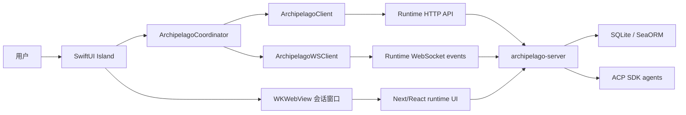

# Archipelago


Archipelago 是一个 macOS 多 Agent 协作应用，用于从同一个桌面入口创建、运行和审阅面向编码任务的多 Agent 群聊。

它以单一产品 `Archipelago.app` 交付。内部由原生 SwiftUI Island 外壳和嵌入式 Archipelago Server 运行时组成：Swift 端负责桌面 Island、窗口管理、打包和系统能力；运行时负责 Web 聊天界面、ACP Agent 会话、SQLite 持久化、产物预览/编辑、设置和 LAN Web Service。

English version: [README.md](./README.md)

## 录屏


https://github.com/user-attachments/assets/89d5c619-5cfc-46a4-ae5e-9dc7cce154d9

## 界面截图


## 目录

- [界面截图](#界面截图)
- [项目亮点](#项目亮点)
- [快速开始](#快速开始)
- [产品界面](#产品界面)
- [仓库结构](#仓库结构)
- [架构](#架构)
- [同步模型](#同步模型)
- [多-Agent-协作](#多-agent-协作)
- [产物预览与编辑](#产物预览与编辑)
- [开发](#开发)
- [Demo 流程](#demo-流程)
- [打包](#打包)
- [GitHub Release](#github-release)
- [常用检查](#常用检查)
- [文档](#文档)
- [项目状态](#项目状态)

## 项目亮点

- 从 macOS Island 创建项目群聊。
- 将群聊绑定到 workspace 文件夹、Agent 集合、角色和主调度 Agent。
- 从 Island 打开主群聊会话，或打开某个群成员 Agent 的独立会话。
- 保持 Island 与 Archipelago Server 之间的群聊和群成员 CRUD 同步。
- 在 Island 中展示实时 Agent 状态：回复中或被委派时 busy，完成后 idle。
- 在 Island 详情页展示最近回复摘要和完成提示。
- 通过 `@agent`、`@all` 或 Island group task auto delegation 协调多个 Agent。
- 在 Agent 回复里渲染内联产物预览卡片。
- 从聊天中预览/编辑代码、Markdown、图片、HTML/iframe、PPTX、Diff 和可用历史。
- 将选中的产物/编辑器内容作为局部修改上下文送回聊天。
- 在嵌入式运行时设置中配置 ACP SDK Agent。
- 通过 token 保护的 API 暴露嵌入式 LAN Web Service。
- 通过 Trellis 保存 AI 协作证据，包括 specs、skills、workflow rules、PRD 和 journal。

当前只维护由 Archipelago 创建或管理的群聊。历史独立 runtime conversation 不会自动导入 Island。

## 快速开始

环境要求：

- macOS 14+
- Xcode Command Line Tools / Swift Package Manager
- Node.js 和 pnpm
- Rust 和 Cargo
- 本地可用的 Agent CLI/SDK 配置

构建并启动集成应用：

```bash
cd modules/collaboration-runtime
pnpm install
pnpm build
```

```bash
cd modules/collaboration-runtime/src-tauri
cargo build --release --bin archipelago-server --bin archipelago-mcp --no-default-features
```

```bash
cd apps/archipelago-macos
swift build --product ArchipelagoApp
zsh scripts/launch-packaged-app.sh
```

启动脚本会打包并打开：

```text
apps/archipelago-macos/output/package/Archipelago.app
```

## 产品界面

### Island

原生 Island 是轻量控制台：

- 折叠态展示群聊/Agent 运行信号和群聊数量。
- 展开首页展示群聊概览、workspace、Agent badge 和状态。
- 群聊详情展示成员、主 Agent、最新回复摘要和群聊操作。
- 新建流程支持选择 workspace、选择 Agent、分配角色和设置主 Agent。

### 嵌入式 Archipelago Server

嵌入式运行时是完整工作台：

- 对话列表和聊天详情。
- Agent 选择、模式/思考强度/权限控制、文件附件和本地文件选择。
- 文件工作区，包含预览、编辑器、Diff 和历史界面。
- Agent 消息中的内联产物预览卡片。
- ACP Agent、MCP、外观、系统、版本控制和 Web Service 设置。

## 仓库结构

```text
.
├── apps/
│   └── archipelago-macos/        # SwiftPM macOS app、Island UI、打包、嵌入式运行时启动器
├── modules/
│   └── collaboration-runtime/    # Next/React UI、Rust HTTP/WS server、ACP runtime、SQLite 持久化
├── docs/                         # 交付文档、产品/技术文档、Demo 脚本、Trellis 证据
├── .trellis/                     # 项目 workflow、spec、任务记录、workspace journal
├── .agents/skills/               # AI 开发会话使用的 Trellis skills
├── DESIGN.md                     # 产品设计语言参考
├── README.md
└── README_zh.md
```

Swift/macOS target、嵌入式运行时身份和 helper 二进制统一使用 Archipelago 产品族命名：Archipelago Server、Archipelago Web、Archipelago MCP、`archipelago-server` 和 `archipelago-mcp`。

## 架构



### macOS App

路径：`apps/archipelago-macos`

职责：

- 渲染折叠态和展开态 Island UI。
- 管理群聊列表、群聊详情、新建群聊、群成员管理和外观设置。
- 从 packaged app bundle 启动嵌入式 runtime helper。
- 将 runtime HTTP/WebSocket 事件桥接到 Island 状态。
- 通过 `WKWebView` 打开嵌入式聊天和设置窗口。
- 向 Web 窗口注入 runtime token 和 embedded 标记。
- 支持 runtime 文件附件所需的系统文件选择。
- 打包为 `Archipelago.app`。

关键文件：

- `Sources/ArchipelagoApp/Views/IslandPanelView.swift`
- `Sources/ArchipelagoApp/ArchipelagoServer/ArchipelagoCoordinator.swift`
- `Sources/ArchipelagoApp/ArchipelagoServer/ArchipelagoClient.swift`
- `Sources/ArchipelagoApp/ArchipelagoServer/ArchipelagoWSClient.swift`
- `Sources/ArchipelagoApp/ArchipelagoServer/ChatWindowController.swift`
- `Sources/ArchipelagoApp/ArchipelagoServer/GroupChatListView.swift`
- `Sources/ArchipelagoApp/ArchipelagoServer/GroupDetailView.swift`
- `Sources/ArchipelagoApp/ArchipelagoServer/CreateGroupChatView.swift`
- `scripts/package-app.sh`
- `scripts/launch-packaged-app.sh`

### Collaboration Runtime

路径：`modules/collaboration-runtime`

职责：

- 提供嵌入式 workspace、conversation、file workspace 和 settings UI。
- 持久化 folder、conversation、group chat、group agent 和 runtime state。
- 为 Claude Code、Codex、Gemini CLI、OpenCode 等 Agent 运行 ACP 会话。
- 为主 Agent prompt 做群聊协作 enrichment 和 delegation。
- 向 Island 发出 group CRUD、agent CRUD、status、completion 和 collaboration-plan 事件。
- 渲染产物预览卡片，并通过共享文件工作区打开产物。
- 提供 packaged helper：`archipelago-server` 和 `archipelago-mcp`。

关键文件：

- `src-tauri/src/web/router.rs`
- `src-tauri/src/web/handlers/groups.rs`
- `src-tauri/src/commands/groups.rs`
- `src-tauri/src/commands/conversations.rs`
- `src-tauri/src/db/service/group_service.rs`
- `src/components/chat/message-input.tsx`
- `src/components/chat/mode-selector.tsx`
- `src/components/chat/session-config-selector.tsx`
- `src/components/message/artifact-preview-card.tsx`
- `src/components/files/file-workspace-panel.tsx`
- `src/components/diff/diff-viewer.tsx`

## 同步模型

Archipelago Server 是 group 元数据的 source of truth。Island 保存渲染投影，并通过 HTTP 快照和 WebSocket 事件刷新。

运行时表：

- `group_chat`
- `group_agent`

主要 group API：

- `GET /groups`
- `POST /groups/create`
- `POST /groups/update`
- `POST /groups/delete`
- `POST /groups/agents/add`
- `POST /groups/agents/update`
- `POST /groups/agents/remove`

主要同步事件：

- `island://group-upserted`
- `island://group-deleted`
- `island://agent-upserted`
- `island://agent-deleted`

运行时生命周期事件：

- `status_changed`
- `content_delta`
- `permission_request`
- `turn_complete`
- `group_collaboration_plan`

如果 Island 收到未知或乱序 group 事件，会重新拉取 `GET /groups`，而不是用不完整 payload 构造状态。

## 多 Agent 协作

每个群聊有一个主 Agent。主 Agent 是该群聊默认的 orchestrator。

支持的协作模式：

- Mention mode：普通 runtime 聊天。`@agent` 或 `@all` 触发协作 enrichment。
- Auto mode：Island group task 模式。没有显式 mention 时等价于 `@all`。

运行时会分析 prompt、解析 active group members、发出 `group_collaboration_plan`、增强主 Agent prompt，并通过已有 ACP/MCP runtime 委派工作。Island 会把被委派成员投影为 busy，直到拿到真实子会话结果或 summary。

## 产物预览与编辑

Assistant 消息可以为生成或引用的产物展示紧凑卡片。卡片只是入口；文件状态仍集中在 WorkspaceContext 和 file workspace 中。

支持的产物路径：

- 代码/文本文件：打开编辑器。
- Markdown/文档类文件：打开渲染预览或源码。
- 图片：展示缩略图和图片预览。
- HTML/Web 产物：可用时打开 iframe 预览，否则回退源码。
- PPTX 文件：浏览提取出的 slide 文本和嵌入图片。
- Diff 产物：打开已有 diff viewer。
- History：在预览界面展示可用版本/历史信息。
- Selected-content edits：把选中的代码或内容作为局部修改上下文送回聊天。

## 开发

环境要求：

- macOS 14+
- Xcode Command Line Tools / Swift Package Manager
- Node.js 和 pnpm
- Rust 和 Cargo
- 本地可用的 Agent CLI/SDK 配置

构建 runtime web assets：

```bash
cd modules/collaboration-runtime
pnpm install
pnpm build
```

构建 runtime helper 二进制：

```bash
cd modules/collaboration-runtime/src-tauri
cargo build --release --bin archipelago-server --bin archipelago-mcp --no-default-features
```

构建 macOS app target：

```bash
cd apps/archipelago-macos
swift build --product ArchipelagoApp
```

启动集成 packaged app 手测：

```bash
cd apps/archipelago-macos
zsh scripts/launch-packaged-app.sh
```

启动脚本会打包并打开：

```text
apps/archipelago-macos/output/package/Archipelago.app
```

集成手测请使用这个 packaged launch path。它会验证 app bundle 中包含嵌入式 runtime helper 和 static assets。

## Demo 流程

1. 启动 `Archipelago.app`。
2. 展开 Island。
3. 新建群聊并选择本地 workspace 文件夹。
4. 选择多个 Agent，例如 Claude Code 和 Codex。
5. 设置主 Agent。
6. 打开嵌入式会话窗口。
7. 发送一个编码任务，观察 Island 状态变为 busy。
8. 使用 `@all` 或 `@agent` 触发多 Agent 协作。
9. 查看 `group_collaboration_plan` 和被委派成员状态。
10. 让 Agent 生成 HTML、Markdown、PPTX、代码或 Diff 产物。
11. 打开内联产物卡片，验证预览/编辑器/Diff 行为。
12. 选择产物内容，并把局部修改请求送回聊天。

更多细节见：[docs/demo-deliverables.md](./docs/demo-deliverables.md)

## 打包

默认产品值：

- App bundle：`Archipelago.app`
- Bundle identifier：`app.archipelago.dev`
- 嵌入式 runtime root：`modules/collaboration-runtime`
- App support 数据目录：`~/Library/Application Support/Archipelago/Server`

主要打包环境变量：

- `ARCHIPELAGO_APP_NAME`
- `ARCHIPELAGO_BUNDLE_ID`
- `ARCHIPELAGO_VERSION`
- `ARCHIPELAGO_BUILD_NUMBER`
- `ARCHIPELAGO_RUNTIME_ROOT`
- `ARCHIPELAGO_RUNTIME_SKIP_BUILD`
- `ARCHIPELAGO_SKIP_BRAND_GENERATION`
- `ARCHIPELAGO_SKIP_DMG`
- `ARCHIPELAGO_SERVER_PORT`
- `ARCHIPELAGO_SERVER_TOKEN`
- `ARCHIPELAGO_SERVER_DATA_DIR`

旧的 `OPEN_ISLAND_*` 变量仍作为兼容 fallback 保留。

## GitHub Release

仓库已包含 release workflow：`.github/workflows/release.yml`。

自动发布：

```bash
git tag v0.1.0
git push origin v0.1.0
```

手动发布：

1. 打开 GitHub Actions。
2. 运行 `Release Archipelago`。
3. 输入 tag，例如 `v0.1.0`。

workflow 会在 macOS runner 上构建 runtime web assets、Rust helpers 和 Swift app，然后上传 release 产物：

- `Archipelago-<tag>.zip`
- 启用 DMG 时的 `Archipelago-<tag>.dmg`
- `Archipelago-<tag>.sha256`

不配置 secrets 也可以产出未签名本地包。需要签名或公证时，配置以下 repository secrets：

- `MACOS_CERTIFICATE_P12_BASE64`
- `MACOS_CERTIFICATE_PASSWORD`
- `MACOS_KEYCHAIN_PASSWORD`
- `APPLE_ID`
- `APPLE_TEAM_ID`
- `APPLE_APP_SPECIFIC_PASSWORD`

可选 repository variables：

- `ARCHIPELAGO_SIGN_IDENTITY`
- `ARCHIPELAGO_APPCAST_URL`
- `ARCHIPELAGO_EDDSA_PUBLIC_KEY`

## 常用检查

```bash
cd apps/archipelago-macos
zsh -n scripts/package-app.sh
zsh -n scripts/launch-packaged-app.sh
swift test --filter ArchipelagoGroupChatTests
swift build --product ArchipelagoApp
```

Runtime 前端检查：

```bash
cd modules/collaboration-runtime
pnpm exec vitest run
pnpm build
```

Runtime 后端检查：

```bash
cd modules/collaboration-runtime/src-tauri
cargo test --lib --no-default-features
cargo build --release --bin archipelago-server --bin archipelago-mcp --no-default-features
```

## 文档

- [docs/README.md](./docs/README.md)：项目交付总览和考察要点映射
- [docs/product-design.md](./docs/product-design.md)：产品设计文档
- [docs/technical-architecture.md](./docs/technical-architecture.md)：技术架构文档
- [docs/ai-collaboration-record.md](./docs/ai-collaboration-record.md)：AI 协作开发记录
- [docs/demo-deliverables.md](./docs/demo-deliverables.md)：可运行 Demo 和 3 分钟视频脚本
- [docs/trellis/README.md](./docs/trellis/README.md)：迁移后的 Trellis specs、skills、workflow rules 和 journal

## 项目状态

Archipelago 仍处于本地活跃开发阶段。公开发布元数据、签名、公证、自动更新分发，以及完整的 artifact 安全沙箱尚未最终定稿。
