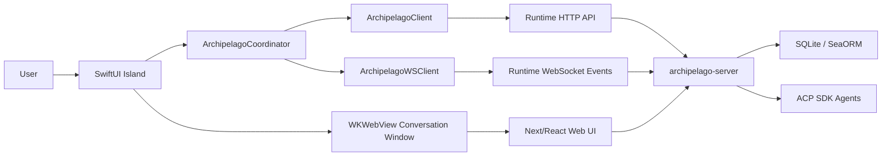

# Archipelago 技术文档

## 1. 总体架构

Archipelago 由 macOS Swift 应用和嵌入式协作运行时组成。Swift 端提供 Island、窗口管理、打包和系统能力；运行时提供 Web UI、Rust HTTP/WS 服务、ACP SDK、多 Agent 会话和 SQLite 持久化。



核心原则：

- Archipelago Server 是 group 元数据的 source of truth。
- Island 只保存和渲染运行时投影。
- HTTP 用于快照和命令，WebSocket 用于事件同步。
- 产物预览、编辑、Diff 复用已有文件工作区，不创建第二套状态模型。

## 2. 仓库结构

```text
apps/archipelago-macos/
  SwiftPM macOS app, Island UI, packaged runtime launcher, WKWebView shell

modules/collaboration-runtime/
  Next/React frontend, Rust server, ACP runtime, SQLite persistence

.trellis/
  workflow, spec, task archive, workspace journal

.agents/skills/
  Trellis skills
```

关键文件：

| 模块 | 文件 | 责任 |
| :--- | :--- | :--- |
| macOS Island | `apps/archipelago-macos/Sources/ArchipelagoApp/Views/IslandPanelView.swift` | Island 展开/折叠入口和群聊 UI 宿主 |
| macOS 协调器 | `ArchipelagoCoordinator.swift` | 启动 runtime、加载 group 投影、处理 WS 事件、同步状态 |
| macOS HTTP | `ArchipelagoClient.swift` | 调用 group、conversation、prompt 等运行时接口 |
| macOS WS | `ArchipelagoWSClient.swift` | 订阅 ACP 和 group lifecycle 事件 |
| macOS WebView | `ChatWindowController.swift` | 打开嵌入式会话窗口、注入 token、处理文件选择 |
| Runtime Web | `modules/collaboration-runtime/src/components/chat/*` | 聊天输入、选择器、权限、模式、会话配置 |
| Runtime Message | `src/components/message/*` | 消息流、tool call、产物预览、委派子线程 |
| Runtime Files | `src/components/files/file-workspace-panel.tsx` | Monaco、图片、Markdown、Diff、预览和编辑 |
| Runtime Rust API | `src-tauri/src/web/router.rs` | HTTP/WS 路由 |
| Runtime Group API | `src-tauri/src/web/handlers/groups.rs` / `commands/groups.rs` | group CRUD |
| Runtime DB | `src-tauri/src/db/service/group_service.rs` | group_chat/group_agent 持久化 |

## 3. 数据模型

运行时持久化 group 元数据：

```text
group_chat
  id
  name
  folder_id
  folder_path
  primary_agent_id
  created_at
  updated_at
  deleted_at

group_agent
  id
  group_id
  agent_type
  role
  conversation_id
  connection_id
  working_dir
  created_at
  updated_at
  deleted_at
```

关键约束：

- `GroupChatInfo.id` 是 Island 群聊稳定 ID。
- `GroupAgentInfo.id` 是 Island 群成员稳定 ID。
- `folder_id` 把群聊绑定到 workspace。
- `conversation_id` 把群成员绑定到 Archipelago Server 会话。
- `connection_id` 是可选运行时状态。
- 删除使用 `deleted_at` 软删除。
- 同一 group 内同一 agent_type 的 active 成员保持幂等更新，不创建重复可见成员。

## 4. 同步模型

### 4.1 HTTP API

主要 group API：

- `GET /groups`
- `POST /groups/create`
- `POST /groups/update`
- `POST /groups/delete`
- `POST /groups/agents/add`
- `POST /groups/agents/update`
- `POST /groups/agents/remove`

Island 在启动、异常事件、用户操作后通过 HTTP 拉取或写入 group 投影。

### 4.2 WebSocket 事件

group CRUD 事件：

- `island://group-upserted`
- `island://group-deleted`
- `island://agent-upserted`
- `island://agent-deleted`

ACP runtime 事件：

- `status_changed`
- `content_delta`
- `permission_request`
- `turn_complete`
- `group_collaboration_plan`

Island 对未知或乱序事件采用保守策略：重新拉取 `GET /groups`，避免用不完整事件直接构造状态。

## 5. IM 和多 Agent 调度

### 5.1 会话绑定

创建群聊时，系统会：

1. 注册 workspace folder。
2. 创建 `group_chat`。
3. 为每个 Agent 创建 conversation。
4. 创建或更新 `group_agent`。
5. 设置 `primary_agent_id`。
6. Island 重新加载 server projection。

### 5.2 主 Agent 和协作计划

主 Agent 是群聊默认对话入口。用户在主 Agent 会话里使用 `@agent` / `@all`，或 Island 使用 `collaborationMode: "auto"` 发送任务时，Runtime 执行 prompt enrichment。

技术路径：

- Rust 分析 prompt 和 group membership。
- 生成 `GroupCollaborationEnrichment`。
- 发送前发出 `group_collaboration_plan`。
- 主 Agent prompt 中加入委派上下文。
- 委派工具启动子 Agent 会话。
- Island 依据计划和子会话事件投影成员状态。

关键语义：

- `mention` 是普通聊天默认模式，没有 mention 不触发协作。
- `auto` 是 Island group task 模式，没有显式 mention 时等价于 `@all`。
- 只有主 Agent conversation 可以触发 group enrichment。
- 被委派成员必须有真实子结果摘要后才恢复完成状态。

## 6. 产物预览与编辑架构

### 6.1 设计原则

消息中的 artifact card 只做轻量入口：

- 在 message layer 检测和渲染卡片。
- 打开、编辑、Diff、保存、历史等交给 WorkspaceContext。
- 避免 artifact 自己维护独立文件 buffer。

复用 API：

- `openFilePreview(path, options?)`
- `openWorkingTreeDiff(path?, options?)`
- `openSessionFileDiff(filePath, diffContent, groupLabel)`
- `toggleFilesMaximized()`
- `readFilePreview(rootPath, path)`
- `readFileForEdit(rootPath, path)`
- `saveFileContent(rootPath, path, content, expectedEtag?)`

### 6.2 支持类型

| 类型 | 行为 |
| :--- | :--- |
| Code/text | Monaco 编辑器打开 |
| Markdown/doc | 文件预览渲染 |
| Image | 缩略图和图片预览 |
| HTML/Web | iframe 预览，失败则回退源码/文件预览 |
| PPTX | 提取 slide 文本和图片，提供浏览视图 |
| Diff | 打开已有 diff 视图 |
| History | 全屏预览内展示版本/历史信息 |
| Selected edit | 选中内容作为局部修改上下文送回 chat |

## 7. macOS 嵌入与系统能力

### 7.1 打包运行时

`Archipelago.app` 包内包含：

- `Contents/Helpers/archipelago-server`
- `Contents/Helpers/archipelago-mcp`
- `Contents/Resources/ArchipelagoWeb/index.html`

运行脚本：

```bash
cd apps/archipelago-macos
zsh scripts/launch-packaged-app.sh
```

该脚本会打包 `.app`，执行 bundle smoke check，然后打开 `output/package/Archipelago.app`。

### 7.2 WKWebView

`ChatWindowController` 负责：

- 打开嵌入式 runtime 页面。
- 在 document start 注入 token。
- 注入 `archipelago_island_embedded=true`。
- 通过 `WKUIDelegate` 处理本地文件选择。
- 支持嵌入式会话窗口的系统级交互。

### 7.3 Web Service

嵌入式 runtime 默认对 LAN 绑定 `0.0.0.0`，Island 内部仍通过 `127.0.0.1:<port>` 访问。外部 API/WS 继续使用 token 认证。

## 8. 质量验证

常用检查：

```bash
cd modules/collaboration-runtime
pnpm build
pnpm exec vitest run

cd modules/collaboration-runtime/src-tauri
cargo build --release --bin archipelago-server --bin archipelago-mcp --no-default-features
cargo test --lib --no-default-features

cd apps/archipelago-macos
swift test --filter ArchipelagoGroupChatTests
swift build --product ArchipelagoApp
zsh scripts/launch-packaged-app.sh

git diff --check
```

针对集成手测，优先使用 packaged app，而不是 `swift run`，因为 packaged path 才能验证 helper、static assets、token 注入和真实 bundle 路径。

## 9. 架构取舍

| 问题 | 选择 | 理由 |
| :--- | :--- | :--- |
| group 元数据归属 | Runtime source of truth，Island 投影 | 避免 Swift/Web 双写漂移 |
| 同步方式 | HTTP 快照 + WS 事件 | 命令可靠、状态实时、异常可重拉 |
| 多 Agent 调度 | prompt enrichment + delegation | 复用 ACP 和现有工具链，不引入复杂调度服务 |
| 产物预览 | 卡片入口 + 共享文件工作区 | 复用保存、dirty、Diff、编辑能力 |
| UI 风格 | SwiftUI Island + macOS 风格 Web runtime | 兼顾原生入口和 Web 迭代速度 |

